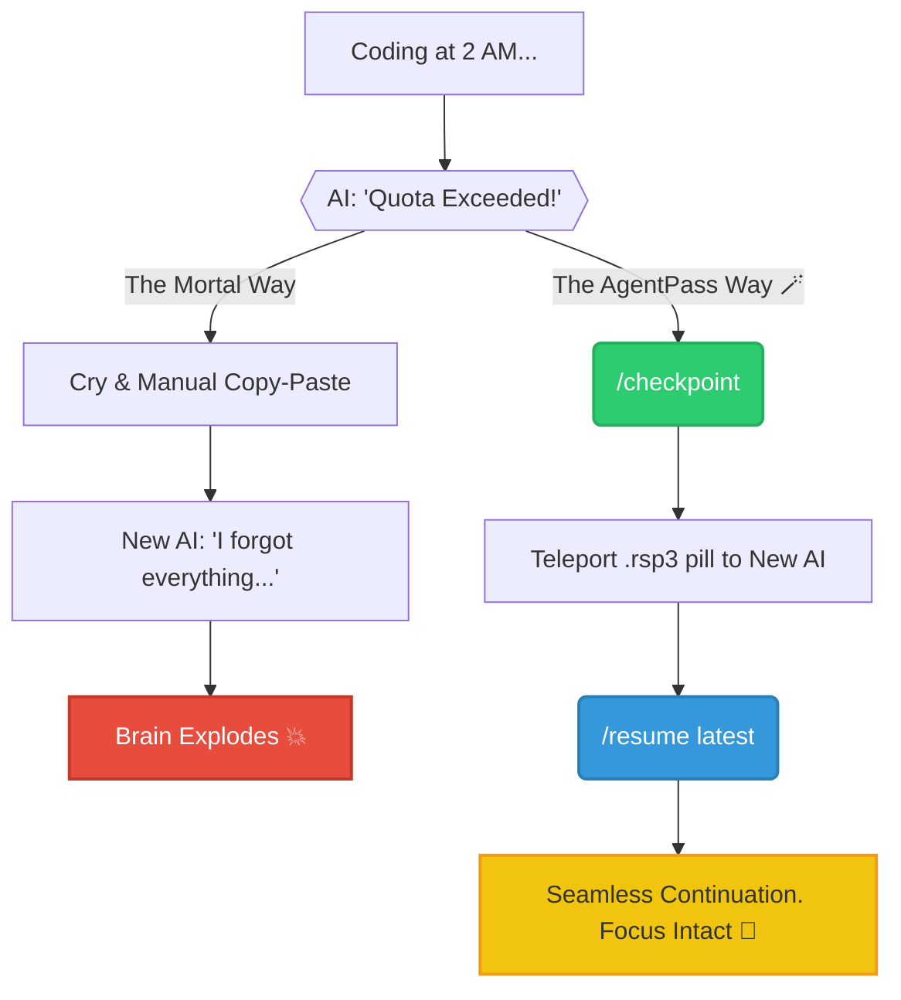

# 🪄 AgentPass: The AI-Sovereignty Protocol (RSP v3.3)


**Stop being a tenant in a walled garden. Own your AI's state.**

AgentPass is a high-performance, file-based protocol that allows you to freeze, export, and teleport your AI's entire cognitive state between **Claude, Cursor, ChatGPT, and Antigravity** in under 5 seconds.

## 🚨 The Problem: AI Lock-in & 'Brain Pollution'
Native AI agents (like OpenCode or Cursor) are powerful, but they trap your context. 
- **The Subscription Trap:** If one provider goes down or limits your quota, your work dies with that session.
- **The Hallucination Spiral:** When an AI gets 'groggy' halfway through a task, you can't 'rewind' its brain easily.
- **The Privacy Gap:** You can't easily move a high-context Cloud session to a local, private LLM.

## 🛠 The Solution: AgentPass (The 'State Pill')
AgentPass treats your development flow as a **Finite State Machine**. It compresses the AI's 'short-term memory' into a bit-perfect `.rsp3` file.

### 📊 Why AgentPass Wins (The Comparison)

| Feature | Native Agents (OpenCode/Cursor) | AgentPass 🪄 |
| :--- | :--- | :--- |
| **Portability** | Locked to one IDE/Provider | **Universal** (Any LLM, Any App) |
| **Cost** | High (Re-reading files uses tokens) | **Low** (Surgical state injections) |
| **Safety** | Trust-based (AI 'guesses' context) | **Hash-Verified** (SHA-256 integrity) |
| **Versioning** | Linear history only | **Time-Machine** (Jump to any save) |

## 📊 The Ascension Chart (Visualizing the Realms)



## 🚀 Quick Setup (Zero-Touch)

**Method A: The 1-Command Way (curl)**
```bash
curl -fsSL https://raw.githubusercontent.com/lawful-meow/AgentPass/main/setup_agentpass.py | python3 - --inject
```

**Method B: AI-Native (Prompt only)**
Paste this to your AI: *'Setup AgentPass for this project. Fetch rules from https://raw.githubusercontent.com/lawful-meow/AgentPass/main/setup_agentpass.py, create directories, and inject into README.md and AGENTS.md.'*

## 💡 Key Commands
- `/checkpoint`: Freeze the AI's brain and save it to `./agentpass_checkpoints/`.
- `/resume latest`: Inject a state pill into a new AI to resume the mission instantly.

## 📂 Core Philosophy: The Independent Developer
AgentPass is built on **RSP v3.3 (Resumable State Protocol)**. It is an open, file-based standard. Even if this repo disappears, your `.rsp3` files remain yours. It is the ultimate insurance policy for your intellectual property and your focus.

--- 
*Built by lawful-meow for the immortal developer.*
